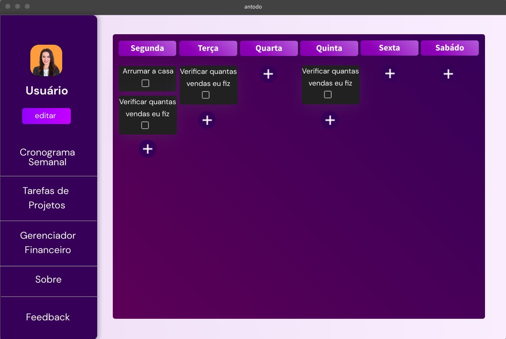
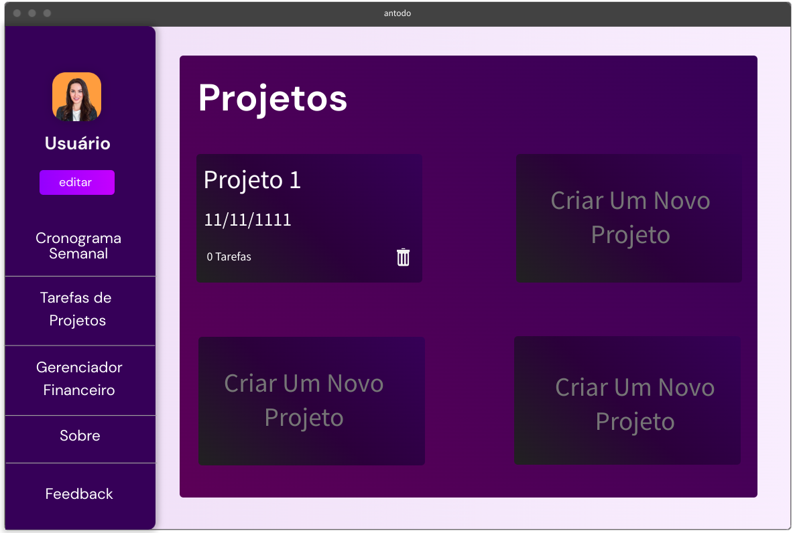

# Antodo
# 🐜 ANTODO

## 🧠 Descrição  
**ANTODO** é um site de organização pessoal que une um cronograma semanal, to-do lists e gerenciamento de projetos em um único lugar. Com uma interface moderna e intuitiva, ele foi criado para quem busca praticidade e foco na rotina diária.

> 🐜 **Sobre o nome:**  
> O nome **ANTODO** vem da junção de:  
> - **"Ant"** (formiga em inglês) — símbolo de organização, proatividade e trabalho em equipe  
> - **"To-do"** — referência às listas de tarefas tão presentes no nosso dia a dia  
>  
> A ideia é trazer a produtividade e a disciplina das formigas para a sua vida pessoal e profissional.

## 🚧 Status do Projeto  
🔧 Em desenvolvimento - Atualização do banco de dados e algumas outras funcionalidades.

## ✨ Funcionalidades  
- ✅ **Cronograma semanal** com tarefas organizadas por dia  
- 🗂️ **Gestão de projetos**, com criação, visualização e exclusão de projetos  
- 🔄 Comunicação com o backend via **AJAX**  
- 💾 Backend desenvolvido com **PHP**  
- 🎨 Interface responsiva com **HTML5**, **CSS3** e **JavaScript**

## 🛠️ Tecnologias utilizadas  
- PHP  
- JavaScript  
- AJAX  
- HTML5  
- CSS3  

## 📸 Demonstração  

### 📅 Cronograma Semanal  
  
*Permite adicionar tarefas por dia da semana com opção de marcar como concluída*

### 📁 Tarefas de Projetos  
  
*Gerencie projetos com tarefas, datas e opções de exclusão*

## 🙋‍♀️ Autora  
Feito com 💖 por **Lavi**
